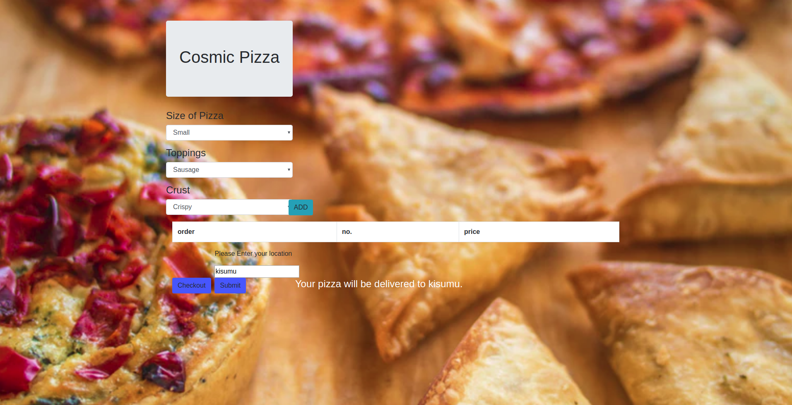

cosmic pizza!

## Description:
- A pizza ordering web application.

## Author:
- John Opana

## Screenshot:

## Setup:
- git clone https://github.com/johnopana/pizza or download the zip file

- Extract the zip file

- cd project folder

- launch the index.html file

## Technologies:
- HTML
- CSS
- Bootstrap
- Javascript
- Jquery
- BDD:
- Inputs	Description
- Pizza Flavour	eg chicken-tikka
- Pizza size	eg medium
- Pizza crust	eg flatbread crust
- Pizza topping	eg Beef peperoni
- Number of pizzas	eg 6
- Delivery mode	eg No delivery
## License:
MIT LICENSE © 2019 John Opana

## Collaborate:
- To contribute to Pizza, reach me on johnopana2016@gmail.com
- slack me (john opana)moringa school

